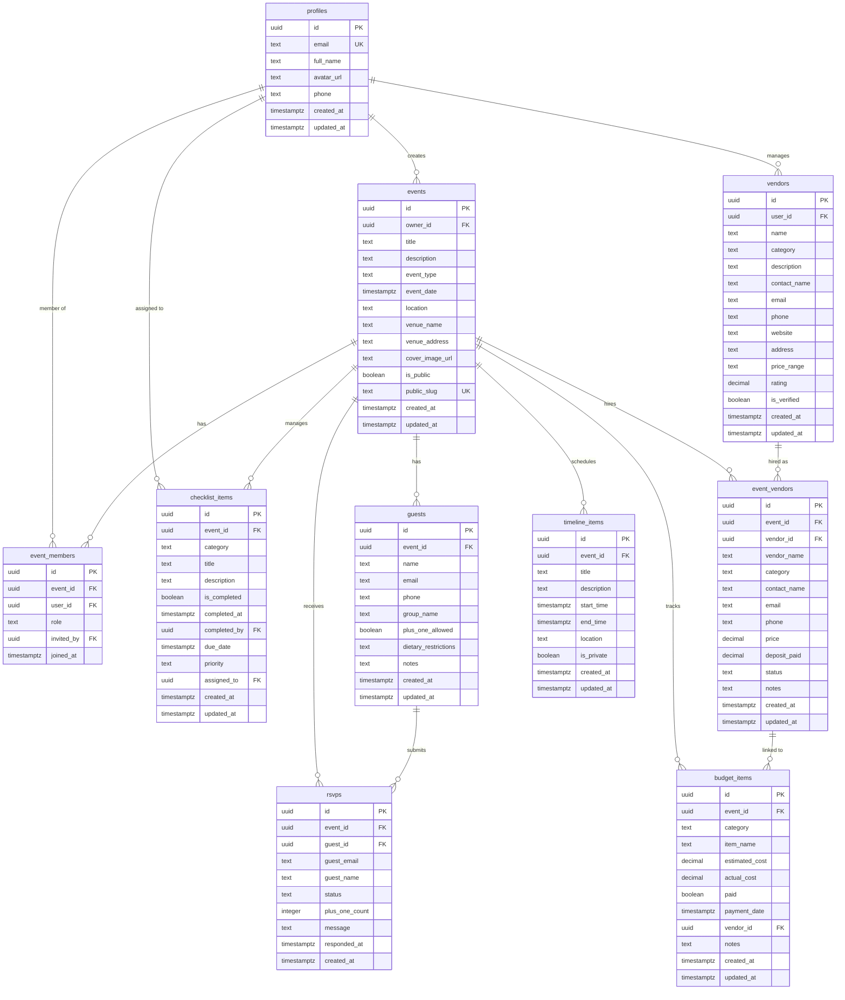

# ShaadiSync - Technical Specification

**Version:** 1.0  
**Last Updated:** 2026-02-28  
**Stack:** Next.js 14, TypeScript, Tailwind CSS, shadcn/ui, Supabase

---

## Table of Contents

1. [Feature Overview](#feature-overview)
2. [Database Schema](#database-schema)
3. [Page Routes](#page-routes)
4. [API Endpoints](#api-endpoints)
5. [Component Architecture](#component-architecture)
6. [Authentication & Authorization](#authentication--authorization)
7. [Supabase Configuration](#supabase-configuration)

---

## Feature Overview

### Core Features

#### 1. **Event Management**
- Create and manage multiple events (wedding, engagement, mehndi, sangeet, reception)
- Event dashboard with overview statistics
- Public event pages with shareable links
- Event timeline and schedule
- Cover images and photo galleries

#### 2. **Guest Management**
- Import/export guest lists (CSV)
- Guest grouping (family, friends, colleagues)
- Dietary restrictions and notes
- Plus-one management
- Guest contact information

#### 3. **RSVP System**
- Public RSVP links (no login required)
- Email/SMS RSVP reminders
- Real-time RSVP updates
- RSVP status tracking (accepted/declined/pending)
- Plus-one count tracking
- Guest messages/dietary restrictions

#### 4. **Vendor Directory**
- Browse vendors by category
- Vendor profiles with ratings and reviews
- Price range filtering
- Contact vendors directly
- Save favorite vendors

#### 5. **Budget Tracker**
- Category-based budget planning
- Estimated vs. actual cost tracking
- Payment status tracking
- Vendor payment linking
- Budget overview and charts
- Export budget reports

#### 6. **Planning Checklist**
- Pre-built templates for different event types
- Custom checklist items
- Task assignments
- Due dates and priorities
- Progress tracking
- Completion notifications

#### 7. **Collaboration**
- Invite family members to collaborate
- Role-based permissions (owner, editor, viewer)
- Activity feed for team updates
- Comments on tasks and items

#### 8. **Timeline Management**
- Day-of schedule builder
- Time-based event breakdown
- Location assignments
- Public/private timeline items
- Print-friendly timeline view

---

## Database Schema

### ER Diagram (Mermaid)



---

## Page Routes

### Public Routes (No Authentication Required)

| Route | Description |
|-------|-------------|
| `/` | Landing page with features and pricing |
| `/login` | Sign in page |
| `/signup` | Sign up page |
| `/forgot-password` | Password reset page |
| `/vendors` | Public vendor directory |
| `/vendors/[category]` | Vendors filtered by category |
| `/vendors/[id]` | Individual vendor profile |
| `/rsvp/[eventSlug]` | Public RSVP page for an event |
| `/events/[eventSlug]/public` | Public event details page |

### Protected Routes (Authentication Required)

| Route | Description |
|-------|-------------|
| `/dashboard` | User dashboard (event overview) |
| `/events/new` | Create new event |
| `/events/[id]` | Event overview dashboard |
| `/events/[id]/guests` | Guest list management |
| `/events/[id]/guests/import` | CSV guest import |
| `/events/[id]/rsvps` | RSVP tracking |
| `/events/[id]/vendors` | Event vendors management |
| `/events/[id]/budget` | Budget tracker |
| `/events/[id]/timeline` | Event timeline/schedule |
| `/events/[id]/checklist` | Planning checklist |
| `/events/[id]/settings` | Event settings |
| `/events/[id]/team` | Manage collaborators |
| `/profile` | User profile settings |
| `/profile/notifications` | Notification preferences |

### API Routes

| Route | Description |
|-------|-------------|
| `/api/auth/*` | Authentication endpoints (handled by Supabase) |
| `/api/events` | CRUD operations for events |
| `/api/events/[id]/rsvp` | Public RSVP submission |
| `/api/guests/import` | CSV import endpoint |
| `/api/guests/export` | CSV export endpoint |
| `/api/vendors/search` | Vendor search/filter |
| `/api/webhooks/rsvp` | RSVP webhook for notifications |

---

## API Endpoints

### Events API

```typescript
// GET /api/events
// List all events for authenticated user
Response: Event[]

// POST /api/events
// Create new event
Body: { title, event_type, event_date, location, ... }
Response: Event

// GET /api/events/[id]
// Get event details
Response: Event

// PATCH /api/events/[id]
// Update event
Body: Partial<Event>
Response: Event

// DELETE /api/events/[id]
// Delete event
Response: { success: boolean }
```

### Guests API

```typescript
// GET /api/events/[id]/guests
// List all guests for an event
Response: Guest[]

// POST /api/events/[id]/guests
// Add new guest
Body: { name, email, phone, ... }
Response: Guest

// POST /api/events/[id]/guests/import
// Import guests from CSV
Body: FormData (CSV file)
Response: { imported: number, errors: Error[] }

// GET /api/events/[id]/guests/export
// Export guests to CSV
Response: CSV file download

// PATCH /api/guests/[id]
// Update guest
Body: Partial<Guest>
Response: Guest

// DELETE /api/guests/[id]
// Delete guest
Response: { success: boolean }
```

### RSVP API

```typescript
// POST /api/events/[slug]/rsvp
// Submit RSVP (public, no auth required)
Body: {
  guest_email: string,
  guest_name: string,
  status: 'accepted' | 'declined',
  plus_one_count: number,
  message?: string,
  dietary_restrictions?: string
}
Response: RSVP

// GET /api/events/[id]/rsvps
// Get all RSVPs for event (auth required)
Response: RSVP[]
```

### Vendors API

```typescript
// GET /api/vendors
// Search/filter vendors
Query: { category?, price_range?, search? }
Response: Vendor[]

// GET /api/vendors/[id]
// Get vendor details
Response: Vendor

// POST /api/vendors
// Create vendor (auth required)
Body: { name, category, contact_name, ... }
Response: Vendor
```

### Budget API

```typescript
// GET /api/events/[id]/budget
// Get budget items
Response: BudgetItem[]

// POST /api/events/[id]/budget
// Add budget item
Body: { category, item_name, estimated_cost, ... }
Response: BudgetItem

// PATCH /api/budget/[id]
// Update budget item
Body: Partial<BudgetItem>
Response: BudgetItem

// DELETE /api/budget/[id]
// Delete budget item
Response: { success: boolean }
```

---

## Component Architecture

### Component Tree

```
app/
├── (auth)/
│   ├── login/
│   │   └── page.tsx
│   ├── signup/
│   │   └── page.tsx
│   └── layout.tsx           # Auth layout (centered, no nav)
│
├── (public)/
│   ├── page.tsx             # Landing page
│   ├── vendors/
│   │   ├── page.tsx         # Vendor directory
│   │   ├── [category]/
│   │   │   └── page.tsx
│   │   └── [id]/
│   │       └── page.tsx     # Vendor profile
│   ├── rsvp/
│   │   └── [slug]/
│   │       └── page.tsx     # Public RSVP form
│   └── events/
│       └── [slug]/
│           └── public/
│               └── page.tsx # Public event page
│
├── (dashboard)/
│   ├── dashboard/
│   │   └── page.tsx         # Main dashboard
│   ├── events/
│   │   ├── new/
│   │   │   └── page.tsx
│   │   └── [id]/
│   │       ├── page.tsx     # Event overview
│   │       ├── guests/
│   │       │   ├── page.tsx
│   │       │   └── import/
│   │       │       └── page.tsx
│   │       ├── rsvps/
│   │       │   └── page.tsx
│   │       ├── vendors/
│   │       │   └── page.tsx
│   │       ├── budget/
│   │       │   └── page.tsx
│   │       ├── timeline/
│   │       │   └── page.tsx
│   │       ├── checklist/
│   │       │   └── page.tsx
│   │       ├── settings/
│   │       │   └── page.tsx
│   │       └── team/
│   │           └── page.tsx
│   ├── profile/
│   │   ├── page.tsx
│   │   └── notifications/
│   │       └── page.tsx
│   └── layout.tsx           # Dashboard layout (sidebar + nav)
│
└── layout.tsx               # Root layout

components/
├── ui/                      # shadcn/ui components
│   ├── button.tsx
│   ├── card.tsx
│   ├── dialog.tsx
│   ├── form.tsx
│   ├── input.tsx
│   ├── select.tsx
│   ├── table.tsx
│   ├── tabs.tsx
│   └── ...
│
├── layout/
│   ├── Header.tsx
│   ├── Sidebar.tsx
│   ├── MobileNav.tsx
│   └── Footer.tsx
│
├── events/
│   ├── EventCard.tsx
│   ├── EventForm.tsx
│   ├── EventHeader.tsx
│   ├── EventStats.tsx
│   └── EventSwitcher.tsx
│
├── guests/
│   ├── GuestList.tsx
│   ├── GuestForm.tsx
│   ├── GuestImport.tsx
│   ├── GuestFilters.tsx
│   └── GuestExport.tsx
│
├── rsvp/
│   ├── RSVPForm.tsx
│   ├── RSVPList.tsx
│   ├── RSVPStats.tsx
│   └── RSVPPublicPage.tsx
│
├── vendors/
│   ├── VendorCard.tsx
│   ├── VendorList.tsx
│   ├── VendorFilters.tsx
│   ├── VendorProfile.tsx
│   └── VendorForm.tsx
│
├── budget/
│   ├── BudgetOverview.tsx
│   ├── BudgetItemList.tsx
│   ├── BudgetForm.tsx
│   ├── BudgetChart.tsx
│   └── BudgetExport.tsx
│
├── timeline/
│   ├── TimelineView.tsx
│   ├── TimelineItem.tsx
│   ├── TimelineForm.tsx
│   └── TimelinePrint.tsx
│
├── checklist/
│   ├── ChecklistView.tsx
│   ├── ChecklistItem.tsx
│   ├── ChecklistForm.tsx
│   ├── ChecklistFilters.tsx
│   └── ChecklistProgress.tsx
│
└── shared/
    ├── LoadingSpinner.tsx
    ├── ErrorBoundary.tsx
    ├── EmptyState.tsx
    ├── ConfirmDialog.tsx
    └── DatePicker.tsx

lib/
├── supabase/
│   ├── client.ts            # Supabase client
│   ├── server.ts            # Server-side Supabase client
│   ├── middleware.ts        # Auth middleware
│   └── types.ts             # Database types
│
├── hooks/
│   ├── useEvent.ts
│   ├── useGuests.ts
│   ├── useRSVPs.ts
│   ├── useVendors.ts
│   ├── useBudget.ts
│   ├── useTimeline.ts
│   ├── useChecklist.ts
│   └── useUser.ts
│
├── actions/                 # Server actions
│   ├── events.ts
│   ├── guests.ts
│   ├── rsvps.ts
│   ├── vendors.ts
│   ├── budget.ts
│   └── checklist.ts
│
└── utils/
    ├── csv.ts               # CSV import/export
    ├── date.ts              # Date formatting
    ├── currency.ts          # Currency formatting
    ├── validation.ts        # Form validation
    └── permissions.ts       # Permission checks
```

---

## Authentication & Authorization

### Authentication Flow

1. **Sign Up:**
   - Email + Password via Supabase Auth
   - Google OAuth
   - Profile auto-created on first sign-in (trigger or hook)

2. **Sign In:**
   - Email + Password
   - Google OAuth
   - Magic Link (optional)

3. **Session Management:**
   - Supabase handles JWT tokens
   - Middleware checks auth state on protected routes
   - Auto-refresh tokens

### Authorization Roles

#### Event-Level Roles

| Role | Permissions |
|------|-------------|
| **Owner** | Full access: create, read, update, delete all event data. Manage team members. |
| **Editor** | Read/write access to guests, vendors, budget, timeline, checklist. Cannot delete event or manage team. |
| **Viewer** | Read-only access to all event data. Cannot modify anything. |

#### Row-Level Security (RLS)

All tables use Supabase RLS policies:
- Users can only access events they own or are members of
- Public events allow read-only access to basic info
- RSVP submissions allowed for public events without auth
- Vendor directory is public read, authenticated write

---

## Supabase Configuration

### 1. Authentication Setup

**Enable Providers:**
- ✅ Email/Password
- ✅ Google OAuth

**Email Templates:**
- Customize confirmation email
- Customize password reset email

**OAuth Configuration:**
```
Google OAuth:
- Client ID: (from Google Cloud Console)
- Client Secret: (from Google Cloud Console)
- Authorized Redirect URI: https://<project-ref>.supabase.co/auth/v1/callback
```

### 2. Database Setup

**Execute Schema:**
1. Go to SQL Editor in Supabase Dashboard
2. Paste contents of `schema.sql`
3. Run the script

**Enable Realtime:**
```sql
ALTER PUBLICATION supabase_realtime ADD TABLE rsvps;
ALTER PUBLICATION supabase_realtime ADD TABLE guests;
ALTER PUBLICATION supabase_realtime ADD TABLE checklist_items;
ALTER PUBLICATION supabase_realtime ADD TABLE timeline_items;
```

### 3. Storage Setup

**Create Bucket: `event-images`**
- Max file size: 5MB
- Allowed MIME types: `image/*`
- Public: Yes (read)
- Authenticated: Yes (write)

**Storage Policies:**
```sql
-- Allow public read access
CREATE POLICY "Public read access"
ON storage.objects FOR SELECT
USING (bucket_id = 'event-images');

-- Allow authenticated users to upload
CREATE POLICY "Authenticated users can upload"
ON storage.objects FOR INSERT
WITH CHECK (
  bucket_id = 'event-images' AND
  auth.role() = 'authenticated'
);

-- Allow users to update their own uploads
CREATE POLICY "Users can update own uploads"
ON storage.objects FOR UPDATE
USING (
  bucket_id = 'event-images' AND
  auth.uid()::text = (storage.foldername(name))[1]
);

-- Allow users to delete their own uploads
CREATE POLICY "Users can delete own uploads"
ON storage.objects FOR DELETE
USING (
  bucket_id = 'event-images' AND
  auth.uid()::text = (storage.foldername(name))[1]
);
```

### 4. Edge Functions

**RSVP Public Link Function:**
```typescript
// supabase/functions/rsvp-public/index.ts
import { serve } from "https://deno.land/std@0.168.0/http/server.ts"
import { createClient } from 'https://esm.sh/@supabase/supabase-js@2'

serve(async (req) => {
  const { eventSlug, guestEmail, guestName, status, plusOneCount, message } = await req.json()

  const supabase = createClient(
    Deno.env.get('SUPABASE_URL') ?? '',
    Deno.env.get('SUPABASE_SERVICE_ROLE_KEY') ?? ''
  )

  // Verify event is public
  const { data: event } = await supabase
    .from('events')
    .select('id, is_public')
    .eq('public_slug', eventSlug)
    .single()

  if (!event || !event.is_public) {
    return new Response(
      JSON.stringify({ error: 'Event not found or not public' }),
      { status: 404 }
    )
  }

  // Create RSVP
  const { data: rsvp, error } = await supabase
    .from('rsvps')
    .insert({
      event_id: event.id,
      guest_email: guestEmail,
      guest_name: guestName,
      status,
      plus_one_count: plusOneCount,
      message,
      responded_at: new Date().toISOString()
    })
    .select()
    .single()

  if (error) {
    return new Response(
      JSON.stringify({ error: error.message }),
      { status: 500 }
    )
  }

  return new Response(
    JSON.stringify({ success: true, rsvp }),
    { headers: { "Content-Type": "application/json" } }
  )
})
```

### 5. Environment Variables

**Required in Vercel:**
```env
NEXT_PUBLIC_SUPABASE_URL=https://your-project.supabase.co
NEXT_PUBLIC_SUPABASE_ANON_KEY=your-anon-key
SUPABASE_SERVICE_ROLE_KEY=your-service-role-key
NEXT_PUBLIC_APP_URL=https://your-app.vercel.app
```

---

## Next Steps

1. ✅ Execute `schema.sql` in Supabase SQL Editor
2. ✅ Enable Google OAuth in Supabase Auth settings
3. ✅ Create `event-images` storage bucket with policies
4. ✅ Deploy RSVP edge function
5. ✅ Add Supabase env vars to Vercel
6. ⏳ Start building UI components

---

**Ready for @Builder to start coding!** 🚀
